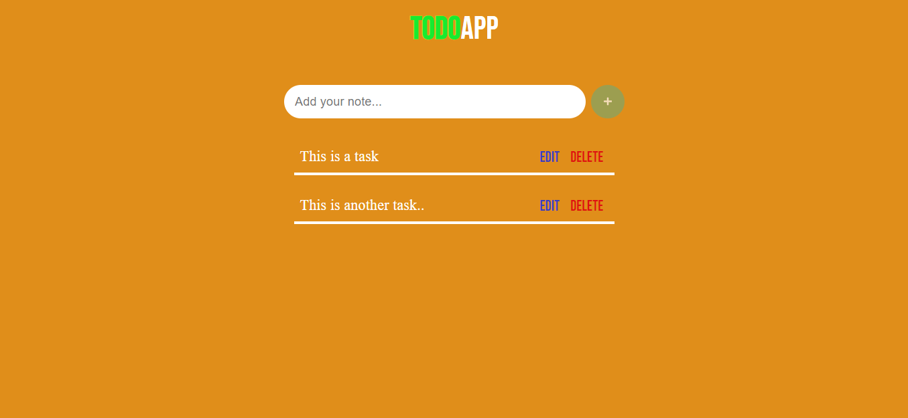
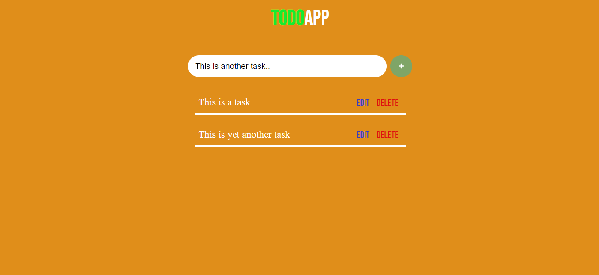

# PRANAV MATHUR

## Learnings from the project:

- DOM methods like _createElement_, _appendChild_, _setAttribute_ and _remove()_
- Adding multiple functions inside addEventListener

## Time taken:

    It took me 8 hours to complete this project.

## Screenshots:

## Live link:

[Go to site](https://11-to-do.netlify.app/)
